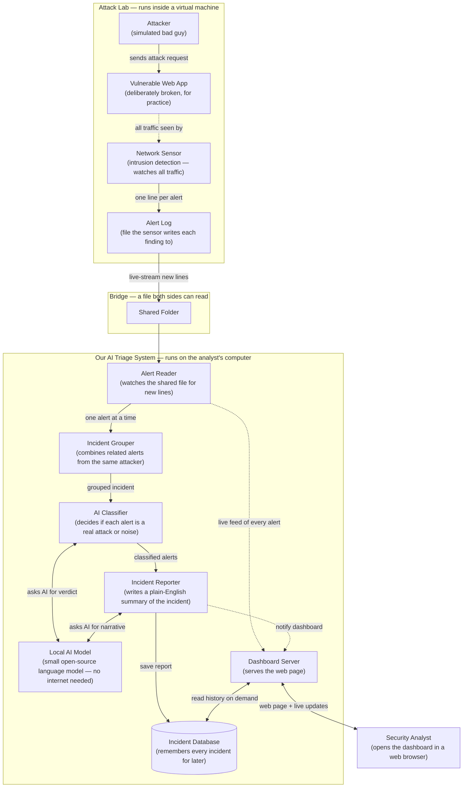
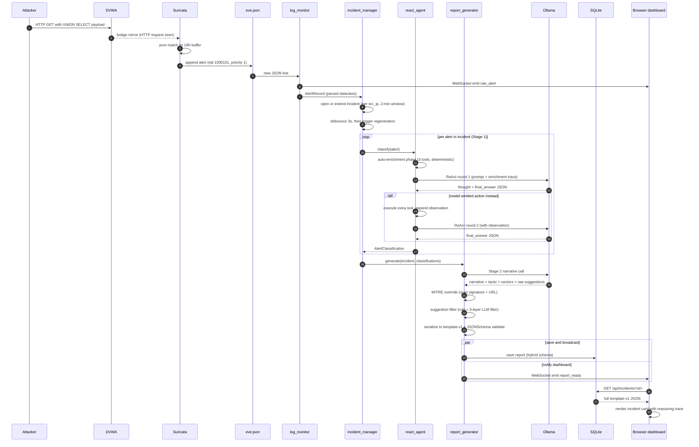
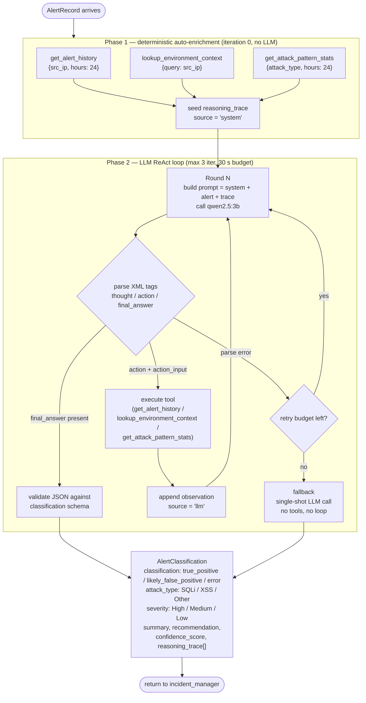
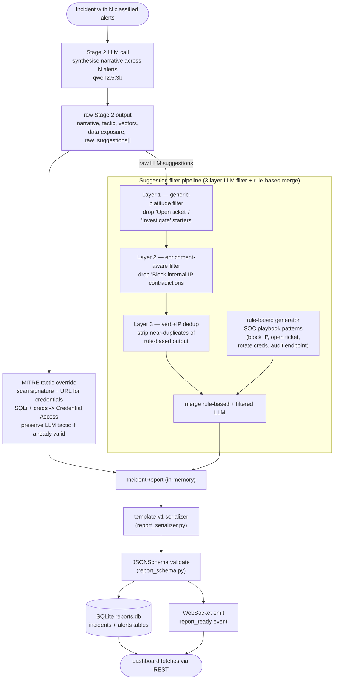
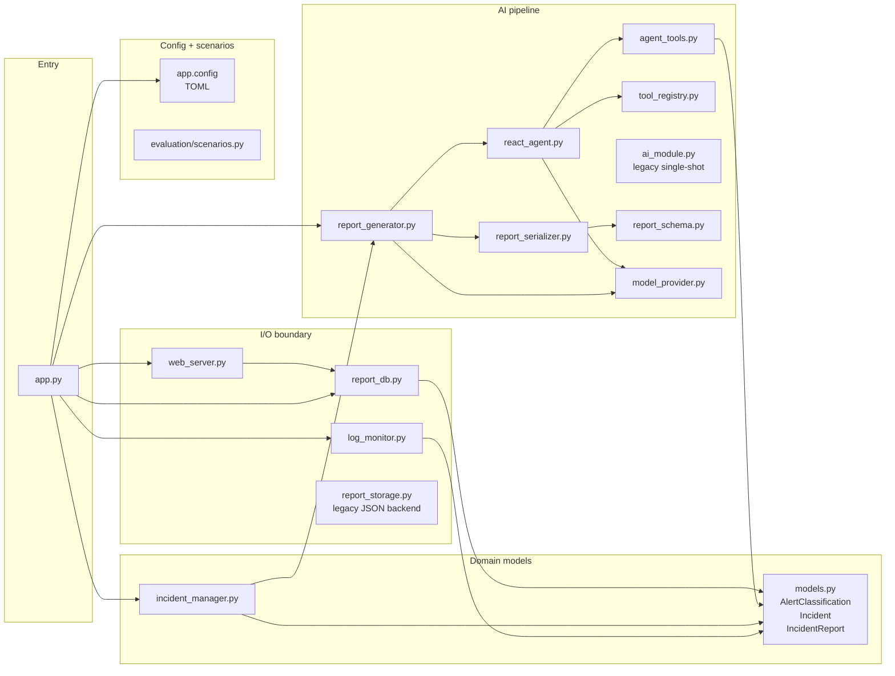

# Architecture and Workflow

Visual reference for the prototype. Five Mermaid diagrams, each zooming further
in than the previous. GitHub renders Mermaid inline in markdown — if a diagram
appears as raw text in your editor, the source is still readable; push to GitHub
or open in any Mermaid-aware viewer.

> **New to the project?** Read in this order: this doc → `docs/HANDOFF.md`
> (written context: what's done, what's left, why) → `README.md` (setup). Each
> diagram below has a short explanation under it; the explanations are part of
> the document, not optional.

## How to read

| Symbol / Style | Meaning |
|---|---|
| **Subgraph box** | Components that share a physical machine, a phase, or a file boundary |
| **Solid arrow** `-->` | Synchronous data or call flow |
| **Dashed arrow** `-.->` / `-->>` | Asynchronous notification, broadcast, or return value |
| **Diamond** `{...}` | Decision point |
| **Cylinder** `[(...)]` | Persistent storage |
| **Stadium** `([...])` | External boundary (caller enters / value leaves) |
| **` ` second line in a node** | File path or implementation detail |
| **Edge label** | Protocol, data shape, or invocation name |

---

## 1. System overview — what happens end to end

Beginner-friendly version. Plain-English roles instead of file names; no host
paths or port numbers. Read it like a story: an attacker pokes a deliberately
broken web app, a network sensor flags the request, and our triage system on
the analyst's computer figures out what happened and shows it on a dashboard.

**The story in one paragraph.** A simulated attacker fires malicious requests
at a deliberately-broken web app inside a virtual machine. A network sensor
watches the traffic and writes each suspicious request as a new line in an
alert log. The triage system on the analyst's computer tails that log, groups
related alerts from the same attacker into a single "incident", uses a small
local AI model to decide which alerts are real attacks and which are noise, and
finally writes a plain-English incident summary that lands on the analyst's
dashboard.

**Why two machines?** The attack lab is risky software on purpose — a
deliberately vulnerable web app plus traffic that looks like real attacks. We
keep it inside a virtual machine so it can't accidentally affect the analyst's
computer. The triage system runs outside the VM because it needs more memory
and uses an AI model that we don't want to install inside the throw-away lab.

**Why a file as the bridge?** Suricata (the sensor) writes its findings to a
file. By making that file visible to both machines via a shared folder, the
triage system can read it without any network connection between the two. No
open ports, no daemons to manage — just a file that grows over time.

**Why a *local* AI model?** The "Local AI Model" box is a small open-source
language model running on the analyst's own computer (via a tool called
Ollama). Local means no data ever leaves the machine, no API costs, no
internet dependency. The model is small (~3 billion parameters) but more than
good enough for this task.

**What does the AI actually do?** Two distinct jobs, both shown above:
1. **Classify each alert** — "Is this a real attack or a false alarm?" The AI
   Classifier checks history ("has this attacker shown up before?") and
   environment context ("is this IP one of our own systems?") before deciding.
2. **Write the incident summary** — once the related alerts are classified,
   the Incident Reporter asks the AI to weave them into a plain-English story
   that the analyst can read in seconds.

**Arrow conventions in this diagram.**
- **Solid arrow** = a normal call or piece of data moving from A to B.
- **Dashed arrow** = an asynchronous event or a passive observation (e.g. the
  sensor watches mirrored traffic; the dashboard gets notified after a report
  saves).
- **Two-way arrow** = a request followed by a response on the same channel
  (e.g. the Classifier asks the AI a question and waits for the answer).

---

## 2. Alert lifecycle — sequence

One alert's complete path from packet to dashboard incident report.

**Two LLM stages.** Stage 1 classifies each alert individually inside the ReAct
agent. Stage 2 builds the cross-alert incident narrative in `report_generator`.
Each uses one or more Ollama calls; both run on the same `qwen2.5:3b` model by
default.

**Debounce prevents thrashing.** Bursts of alerts (e.g. one HTTP request firing
three custom rules at once) collapse into a single regeneration 3 s after the
last alert arrives. The dashboard sees the alerts immediately via raw_alert
events; the incident report follows once classification + Stage 2 finish.

**Two paths to the browser.** Raw alerts go through WebSocket as they arrive
(real-time feed). Incident reports go through WebSocket (live update) *and*
SQLite (so a page reload reconstructs the report from persisted state via REST).

---

## 3. ReAct agent internals

Inside `react_agent.classify(alert)`. Implements the hybrid Option F design —
deterministic enrichment first, then the LLM drives the rest.

**Phase 1 fires the tools the LLM should almost always want anyway.** Without
this scaffold, small models often skip enrichment and classify from the alert
msg alone, losing the contextual signal (prior-alert counts, untrusted-source
flag, attack-type history). The deterministic phase guarantees the LLM sees the
enrichment results before it speaks.

**Phase 2 lets the LLM still explore.** The model can emit further tool calls
if needed (e.g. checking a different attack type's pattern stats), or jump
straight to `<final_answer>`. Most classifications resolve in iteration 1
because Phase 1 already answered the question.

**Fallback is single-shot.** If parsing fails repeatedly or the time budget
expires, the loop bails to a direct LLM call with no tools, classifying from the
msg alone. Better than no classification — the result is still consistent with
the rest of the pipeline.

---

## 4. Stage 2 pipeline — incident to report

Inside `report_generator.generate(incident, classifications)`. Runs once per
incident regeneration (not once per alert).

**One LLM call per incident**, not per alert. Stage 2 synthesises across all
classifications — cross-alert narrative ("UNION SELECT followed by INTO OUTFILE
from the same IP") only emerges here.

**Deterministic post-processing fixes known LLM weaknesses.** The MITRE override
corrects tactic when the LLM picked something wrong (forces Initial Access for
generic SQLi, bumps to Credential Access when the URL names credentials), while
preserving the LLM's choice when it's already valid. The 3-layer suggestion
filter strips generic platitudes, drops suggestions that contradict enrichment
("block internal IP" when the IP belongs to a documented internal system), and
removes near-duplicates of rule-based output.

**Template-v1 is the wire format.** The serializer reshapes the in-memory report
into the JSON shape the dashboard and persistent store expect; the JSONSchema
validation is a hard guard against accidental field drift over time.

---

## 5. Module map — who imports whom

File-level dependency map. Use this when reading the code top-down or when
locating the owner of a specific behaviour.

**Recommended reading order to learn the codebase:**

1. **`app.py`** — wires everything together; start here.
2. **`models.py`** — data shapes (AlertClassification, Incident, IncidentReport);
   understand these before reading consumers.
3. **`log_monitor.py`** — input boundary.
4. **`incident_manager.py`** — grouping + lifecycle + debounce.
5. **`react_agent.py`** + **`agent_tools.py`** — Stage 1 (AI pipeline).
6. **`report_generator.py`** — Stage 2 + MITRE override + suggestion filters.
7. **`report_serializer.py`** + **`report_schema.py`** — wire format.
8. **`report_db.py`** — persistence layer.
9. **`web_server.py`** — dashboard + REST + WebSocket.

**Legacy / fallback paths you can skip on first read:**

- `ai_module.py` — legacy per-alert single-shot classifier; superseded by
  `react_agent.py`. Still imported because the single-shot fallback path in the
  ReAct loop reuses some helpers.
- `report_storage.py` — legacy JSON-file backend; superseded by `report_db.py`
  (SQLite). Selectable via `[storage].backend = "json"` in `app.config` for
  comparison runs.

---

## Where to go next

| You want to... | Read |
|---|---|
| See what's done + what's left + branch state | `docs/HANDOFF.md` |
| Understand the agent design decisions | `docs/AGENT_DESIGN.md` |
| Run the evaluation campaign | `docs/PHASE_6_RUNBOOK.md` |
| Understand the SQLite layer | `docs/PHASE_10_SQLITE.md` |
| Deploy or modify the Suricata rules | `lab/suricata/README.md` |
| Set up the lab from a clean machine | top-level `README.md` |
